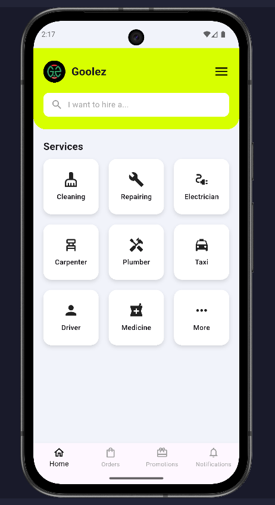

# Gooleez Service App (Flutter + Firebase)

## Overview
Gooleez is a Flutter mobile service application prototype that allows users to login using Firebase Authentication and view available home services.

This project was created as part of my Flutter learning portfolio to practice UI design, authentication, and navigation.

## Features
- Splash Screen
- User Login (Firebase Authentication)
- Home Screen Service Listing
- Screen Navigation
- Clean UI Layout

## Tech Stack
- Flutter
- Dart
- Firebase Authentication
- Material UI

## How to Run
1. Clone this repository
2. Run flutter pub get
3. Run flutter run

## Screenshots

### Splash Screen

